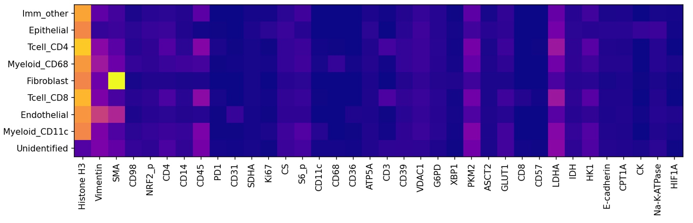
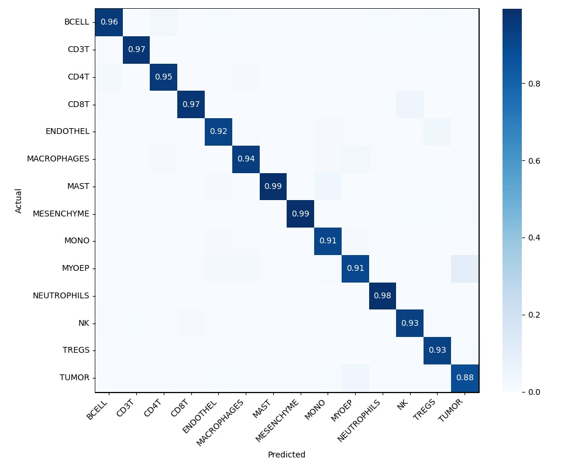

# Assignment 1: Cell Classification

```{admonition} Due Date
Friday 4/21 at 5pm
```

The purpose of this assignment is to get some practice with the machine learning pipeline -- data preprocessing, setting up a model, making a training loop, and reading out metrics. In this assignment, you'll be classifying single cell data from a [MIBI-TOF](https://www.science.org/doi/10.1126/sciadv.aax5851) experiment. You can download the data from [here](https://storage.googleapis.com/bebi205-spring2023/keren.tar.gz).

## Task

For this assignment, you should make a classifier that takes an image of a single cell as input and returns the cell type. Your model can be anything -- if you've never done any machine learning, feel free to make a linear classifier as covered in [class](notebooks/linear-classifier), but you're welcome to try something more complicated.

## Data Schema

The data for this assignment is a sanitized version of data published by the [Angelo Lab](https://www.angelolab.com/mibi-data). The dataset contains `*.npz` files, which you can read using numpy ([`np.load`](https://numpy.org/doc/stable/reference/generated/numpy.load.html)). There are three fields in the data: `X`, `y`, and `cell_types`. `X` provides a numpy array with shape (batch, height, width, channel). `y` is a segmentation mask -- a numpy array with shape (batch, height, width, 2). The last index referring to nuclear and whole cell segmentations respectively. `cell_types` is a dictionary mapping the mask indices to the cell types. To download and unarchive the data, use the following commands. The download itself may take about 10 minutes depending on your internet speed.

```bash
curl -o keren.tar.gz https://storage.googleapis.com/bebi205-spring2023/keren.tar.gz
tar -xzvf keren.tar.gz
```

`meta.yaml` contains a mapping between the cell type codes (in `cell_types`) and the actual cell types as strings. It also contains the names of the channels in `X`. A sample `meta.yaml` file is included below. You may notice that there are several targets that are not biological, e.g. Au, C and P. These are controls associated with the MIBI-TOF workflow and can be excluded from cell type analysis.

````{admonition} meta.yaml
---
class: dropdown, note
---
```yaml
cell_types:
  0: BACKGROUND
  1: TUMOR
  2: MYOEP
  3: FIBROBLAST
  4: ENDO
  5: MONODC
  6: MONO
  7: MACS
  8: DC
  9: APC
  10: MAST
  11: CD8T
  12: CD4T
  13: BCELL
  14: TCELL
  15: NEUT
  16: IMMUNEOTHER
  17: OTHER
  18: FAILED_HARMONIZATION
targets:
- AR
- Au
- Ca40
- CD11c
- CD14
- CD20
- CD31
- CD36
- CD3
- CD44
- CD45
- CD4
- CD56
- CD68
- CD8
- CK5
- CK7
- COL1
- COX2
- C
- E-cadherin
- ER
- FAP
- FOXP3
- GLUT1
- GZMB
- HER2
- HH3
- HIF1a
- HLADRDPDQ
- IDO1
- Ki67
- MMP9
- MPO
- P63
- PanCK
- PD1
- PDL1
- pS6
- P
- SMA
- Tryptase
- VIM
- sum of P and Histone H3
- sum_PanCK_CD45
```
````

## Suggested outline

If you're stuck on where to start, here's a suggested outline.

1. Make the marker expression panel (see [Deliverables](deliverables) for more details). Use this to decide which channels to keep.
1. Use the cell segmentations to make a training dataset, where each element is a cropped view with channel data centered on each cell. Your training dataset will reqire some amount of feature engineering (e.g., normalize the channels). Save this dataset. Note: you can make a small version of this dataset with just a couple of images, use this to debug and make sure your model is "somewhat" learning, then expand using the remaining images.
1. Set up a training pipeline (e.g., with a linear model) using the dataset of individual cells.

(deliverables)=

## Deliverables

You should prepare a short report (~1 page) containing four things

1. A marker expression panel. This is a representation of how different markers (channels) correlate with the different celltypes. An example (for an unrelated dataset) is shown below.



Spend a little time and think about the best way to normalize the expressions -- e.g., do you want to average over cells? How do you deal with the fact that different channels will have different scales (e.g., for some channels, 1 may be a large number, whereas for others 1 may be a very small number)? How do you deal with outliers? The marker expression panel is useful to guide the data processing -- see [the original paper](<https://www.cell.com/cell/fulltext/S0092-8674(18)31100-0>) if you want some more details on what sorts of transformations people use.

2. A confusion matrix. This plots the predicted versus the actual cell types. An example is shown below



Note: you should use a "holdout" dataset to make the confusion matrix -- i.e., don't include some small fraction of your dataset in training, and use it to both ensure your model generalizes and to make the confusion matrix (this will be a familiar idea if you've done ML before.)

3. A link to a Github repo with your code. *Your code must be runnable and approximately reproduce your confusion matrix.* We've held out several images from the dataset that we'll use to test your code. This means your code must expose a function (and specify what that function is in your README) that accepts an `X` and `y` (use the data we gave you as a base), does whatever data preprocessing you want, passes it through your model, and then returns a dictionary mapping segmentation mask ids to celltype codes.

There are different levels/complexity to reproducibility. For truly reproducible code, you should run your experiments from within a Docker container and commit your Dockerfile to the Git repo. For the purposes of this class, you could simply commit an `environment.yaml` (generated from conda) or a `requirements.txt` file. If you're using vanilla PyTorch/Tensorflow/Jax, these will probably suffice (Docker does make setting up a GPU compatible environment much, much easier, though). We make two recommendations: first, save your model (Tensorflow, PyTorch, and Jax all have built in functionality for this) and upload it to Google Drive, then leave a link in your Github. You should include a small script showing how the model weights can be loaded and run. Second, include a training script so your model can be retrained from scratch.

4. A *brief* description of any issues / thoughts you have on the data, the nature of the task, downstream issues, etc. Describe any decisions and their rationale you made during data preprocessing (e.g., I included channel X because...) We emphasize brief -- most of your time on this assignment should spent coding -- after making the images and pushing to Github, this section of the submssion should take ~15 minutes.

## General guidelines

1. Keep your code modular and clean.
1. We aren't grading you on performance -- just think carefully about the problem and make a reasonable first pass of a model. If your data processing/model are well thought out but your accuracies aren't great, that's fine, just document what you think are the likely reasons your model isn't performing well.
1. Start early and reach out with specific questions. You will need time to actually train the model and these things always take longer than you expect.

```{admonition} Submission
---
class: note
---
Submit on Canvas by April 14th at 5pm.
```
