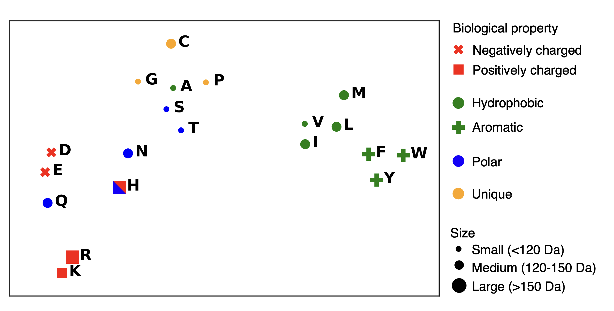

# Assignment 4b: Masked proteins

```{admonition} Due Date
Friday 5/12 at 5pm
```
In this assignment, you'll use masked pretraining to develop embeddings for amino acids. You'll use the Uniprot dataset, which is an excellent starting point for protein modeling containing thousands of proteins, conveniently available on HuggingFace (`damlab/uniprot`).

## Suggested outline
We went over a few different language models in lecture / recitation. Pick one, and use masked pretraining (i.e., block out part of the sequence and predict it) as a task. There are numerous models you can use -- a full transformer, a WaveNet, etc. Speak to the TAs if you have questions.

```{note}
This assignment should not take very long. For context, our solution takes around 100 lines of code without using any pre-made layers. The most important thing is to understand how to properly set up a sequence prediction problem. This is particularly important to understand the failure modes of e.g., large pretrained language models like ESM. 
```
## Data
```python
import datasets
ds = datasets.load_dataset("damlab/uniprot")
ds["train"]["sequence"][0] # Inspect the sequence data
```

## Deliverables
1. A link to your code
2. A brief description of your model
3. An image visualizing your embeddings by amino acid. See the example below




Briefly comment on what you see. Are amino acids with similar properties clustered near each other?

4. Briefly discuss your model's performance -- e.g., reasonable baselines, how you could improve things. Comment on what things one would need to consider when training a larger scale, more general version of this model.

```{admonition} Submission
---
class: note
---
...
```
